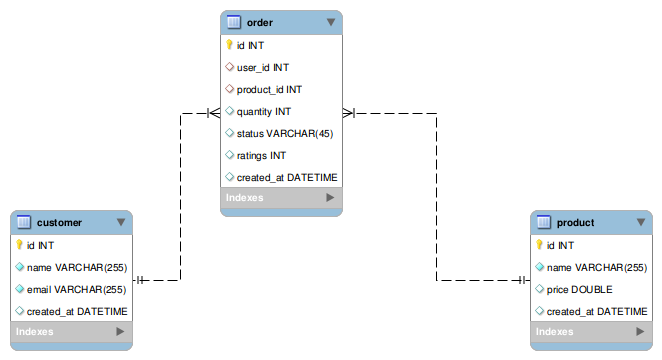

# Rating Application

Rating application provides the means for customers to give ratings to the products they have bought.

## Introduction

This app is a very simple flask app to give product ratings built using Flask, flask-restful, marshmallow, SQLAlchemy.
It comes with basic models : 

* User Model :
    * id: Integer
    * username: String
    * email: String
    * created_at: Datetime
    
* Product Model :
    * id: Integer
    * name: String
    * price: Float
    * created_at: Datetime
    
* Order Model :
    * id: Integer
    * user_id: Integer
    * product_id: Integer
    * quantity: Integer
    * ratings: Integer (0-5)
    * created_at: Datetime

Scenario:

* A customer should be able  to provide ratings to the products purchased.
* A basic product detail should consist the average consumer ratings.

Used packages :

* [Flask](http://flask.pocoo.org/)
* [Flask-RESTful](https://flask-restful.readthedocs.io/en/latest/)
* [Flask-Migrate](https://flask-migrate.readthedocs.io/en/latest/)
* [Flask-SQLAlchemy](http://flask-sqlalchemy.pocoo.org/2.3/)
* [Flask-Marshmallow](https://flask-marshmallow.readthedocs.io/en/latest/)
* [marshmallow-sqlalchemy](https://marshmallow-sqlalchemy.readthedocs.io/en/latest/)
* [passlib](https://passlib.readthedocs.io/en/stable/)
* [tox](https://tox.readthedocs.io/en/latest/)
* [pytest](https://docs.pytest.org/en/latest/)
* [factoryboy](http://factoryboy.readthedocs.io/en/latest/)
* [dotenv](https://github.com/theskumar/python-dotenv)


## Usage

### Installation

In this demo app, our app is called `rating_app`

Once project is downloaded and unzip the project. (Requires python 3.6+)

```
cd rating_app
pip install -r requirements.txt
pip install -e .
```

You have now access to cli commands and you can init the app

```
rating_app init
```

To list all commands

```
rating_app --help
```

To run the application

```
rating_app run
```

### Create User
```bash
curl -X POST http://127.0.0.1:5000/api/v1/users -H 'Content-Type: application/json' -d '{"username": "user2", "email": "user2@mail.com"}'
```

### Create Product
```bash
curl -X POST http://127.0.0.1:5000/api/v1/products -H 'Content-Type: application/json' -d '{"name": "Table", "price": 20.0}'
```

### Create Order
```bash
curl -X POST http://127.0.0.1:5000/api/v1/products -H 'Content-Type: application/json' -d '{"name": "Table", "price": 20.0}'
```

### List Users
```bash
curl -X GET http://127.0.0.1:5000/api/v1/users -H 'Content-Type: application/json'
```

### List Products (Provides product details such product name, price and average consumer ratings)
```bash
curl -X GET http://127.0.0.1:5000/api/v1/products -H 'Content-Type: application/json'
```

### List Orders
```bash
curl -X GET http://127.0.0.1:5000/api/v1/orders -H 'Content-Type: application/json'
```

### Update Order (Provide ratings to the purchased product)
```bash
curl -X PUT http://127.0.0.1:5000/api/v1/orders/1  -H 'Content-Type: application/json' -d '{"ratings": 3}'
```

### Running tests

Simplest way to run tests is to use tox, it will create a virtualenv for tests, install all dependencies and run pytest

```
tox
```

But you can also run pytest manually, you just need to install tests dependencies before

```
pip install pytest pytest-runner pytest-flask pytest-factoryboy factory_boy
pytest
```
